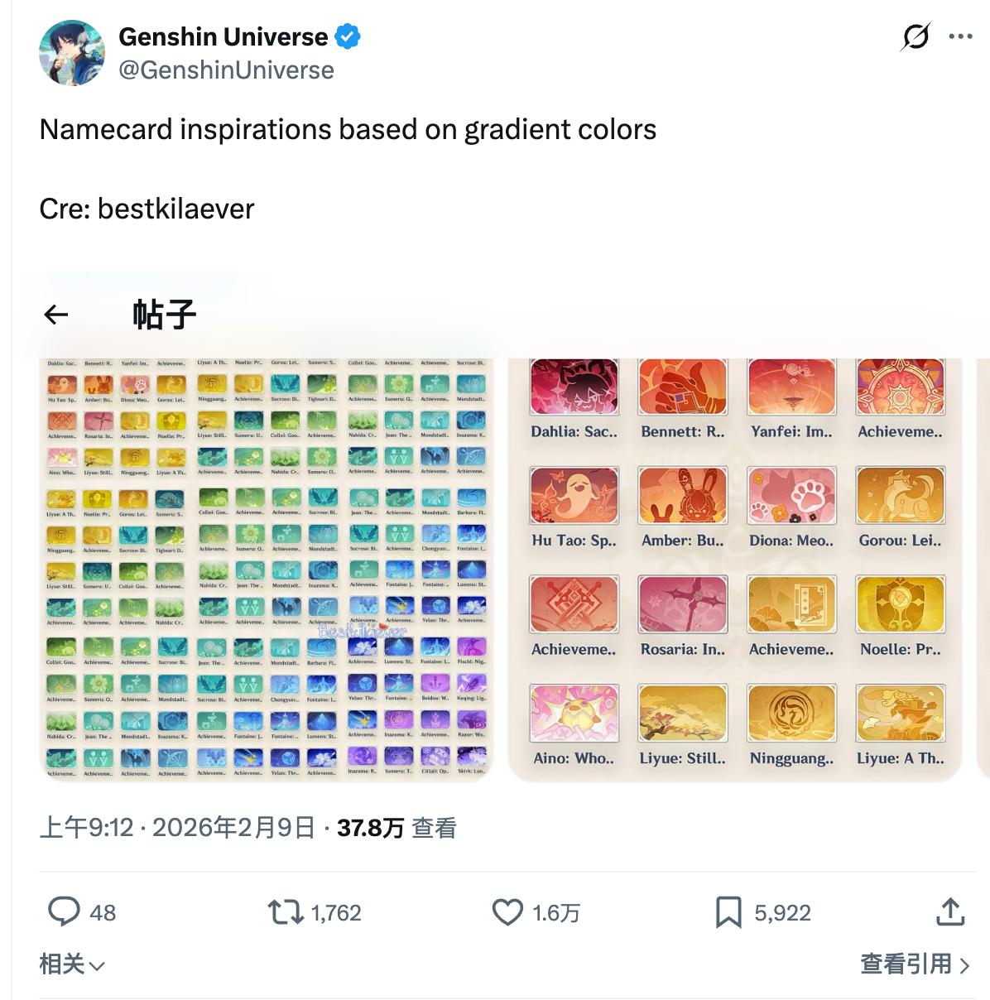

# 提瓦特色谱 (Teyvat Color Spectrum)

将原神名片排列成渐变色马赛克图案的单页 Web 应用。

## 功能

- **名片浏览** — 270 张名片，支持名称搜索、地区/元素筛选入口（含挪德卡莱地区，待数据字段补全后生效）、纪行名片开关（默认关闭）
- **智能渐变匹配** — 选两个颜色 + 方向，算法自动从名片库中选出 16 张排列成 4×4 渐变色矩阵（方向/预设变化即时重排，拾色器调色去抖后重排，无需手动生成）
- **主视觉颜色预处理** — 使用 sharp 读取名片像素，culori 转换 OKLab/OKLCH/HSL，按 hue 分桶聚合（低饱和归入中性桶）、主色占优时按 OKLab 明度拆分，输出 Top 4 主题色、Hex 和占比
- **拖拽交互** — 从名片墙拖入预览槽位，槽位间拖拽交换，拖出网格删除
- **填充模式** — 开启后把名片拖到网格的起点角/止点角，自动将该端渐变色取为名片色并重排整盘（起止角随方向自适应）
- **布局复制/恢复** — 将当前 4×4 名片排布复制到剪贴板，也可从剪贴板恢复布局（不可用名片会跳过）
- **PNG 导出** — 2 倍分辨率导出预览图
- **移动端适配** — 小屏自动切为单列，预览在上、名片墙在下

## 技术栈

React 18 · Vite 5 · TypeScript · Less · Ant Design 5

## 快速开始

```bash
npm install
npm run dev        # 启动开发服务器 → http://localhost:5173
npm run build      # 生产构建
npm run typecheck  # TypeScript 类型检查
npm run colors     # 重算主题色并写回 public/namecards.json
```

## 匹配算法

输入起止两色 + 方向，输出 16 格名片摆放：

1. **目标色**：4×4 按对角线分 7 组（权重 0..6，尺寸 1-2-3-4-3-2-1），在 HSL 中对起止色插值出 7 个目标色；色相走最短环形路径，插值使用对称 gamma 让中段在弱覆盖场景下保持端点特征
2. **直接优化质量分**：算法直接以离线评分脚本的 quality 为目标函数（色相锚定奖励 − 梯度贴合/邻居平滑/对角线内聚/对角线色相散度/杂色惩罚），不再用代理 cost、纯色池或匈牙利指派。每张候选只预计算一次评分相关量（到各对角线目标的最佳距离、主色 HSL/OKLCH、单卡杂色值），全部来自现有 `themeColors`
3. **贪心初始化**：按对角线权重顺序，每个自由槽取目标距离最小且未用的卡；填充模式锁定的槽位固定、不进入候选池
4. **爬山重组**：在「交换两个自由槽」和「用池中卡替换某个自由槽」两类邻域里取使 quality 提升最大的一步，直到无法提升（≤400 步）
5. **随机重启**：确定性随机重启 ×8 取最优，缓解弱覆盖配色的局部最优；同输入稳定可复现。离线 `matching-generate.cjs` 复用同一优化器，无锁 tl-br 场景与前端逐格一致

### 可调参数

`src/utils/gradient.ts` 质量分权重（必须与离线 `matching-score.cjs` 完全一致）：

| 参数 | 当前值 | 作用 | 调大效果 |
|---|---|---|---|
| `W_MONO` | 40 | 色相锚定奖励（唯一奖励项，每格主色绝对贴合目标色） | 主色更贴近目标色相 |
| `W_GRADIENT` | 50 | 单格目标贴合惩罚 | 目标色更准 |
| `W_NEIGHBOR` | 22 | 相邻格主色距离惩罚 | 过渡更顺 |
| `W_DIAG_COHESION` | 30 | 同对角线主色散度惩罚 | 同对角线更凝聚 |
| `W_DIAG_HUE` | 20 | 同对角线 OKLCH 色相散度惩罚（÷90 归一） | 同对角线色相更一致 |
| `W_PURITY` | 16 | 单卡杂色惩罚 | 更偏好纯净名片 |
| `MASS_PENALTY_WEIGHT` | 0.035 | 最佳主题色距离里的质量惩罚 | 更偏好高占比命中主题色 |

其他：优化器 `RESTARTS=8`、`HILL_ITERATIONS=400`、`RNG_SEED=0x9e3779b9`；目标插值 gamma `1.25` 在 `src/utils/targets.ts`；6 个预设（沿 HSL 色相环每 60° 取一对、中低饱和，文艺命名：朝霞流金/金穗新蕖/林深见海/碧波映天/暮云凝紫/紫霞酡红）起止色在 `src/hooks/useGradient.ts`；预处理参数（hue 分桶数、低彩色饱和度/色度门控、主色明度拆分阈值、主题色最小占比、内容区域内缩比例）在 `scripts/calc_theme_colors.cjs`，改后需重跑写回 `namecards.json`。

## 项目结构

```
src/
  main.tsx                  # antd ConfigProvider + React 入口
  App.tsx / App.less        # 根布局、筛选/禁用/填充模式/剪贴板编排
  types/                    # Namecard、FilterState、GradientPreset 等类型
  hooks/
    useNamecards.ts         # 读取 namecards.json，搜索/分类筛选与匹配候选池
    usePreview.ts           # 16 格预览槽位 drop/swap/fill/remove 状态
    useGradient.ts          # 颜色端点、方向、预设、去抖提交与生成入口
    useDisabled.ts          # localStorage 禁用名片集合
  components/
    NamecardWall/           # 名片墙、筛选条、可拖拽缩略图
    Preview/                # 4×4 预览网格、渐变控制、导出/复制/导入按钮
    Modal/                  # 名片详情与主题色复制
  utils/
    color.ts                # RGB/HSL 转换与 HSL 距离度量
    grid.ts                 # 4×4 网格几何、对角线权重、邻居边
    targets.ts              # 7 条对角线目标色计算
    themeColors.ts          # 主题色校验、预处理和目标色匹配
    gradient.ts             # 直接最大化质量分的爬山重组匹配算法
    layout.ts               # 剪贴板布局序列化/解析
    export.ts               # html2canvas 导出
scripts/
  calc_theme_colors.cjs      # 计算主题色并写回 namecards.json
docs/specs/
  matching-core.md           # 匹配算法结论、评分口径和维护规则
  matching-generate.cjs      # 离线生成布局，复用前端 gradient.ts
  matching-score.cjs         # 独立质量评分与基准回测
public/
  namecards.json            # 名片基础信息 + themeColors 颜色信息
  cards/                    # 270 张名片 PNG
  source/                   # 灵感来源截图
```

## 项目来源

本项目灵感来自 Twitter 上 [@GenshinUniverse 的这篇帖子](https://x.com/GenshinUniverse/status/2020666981930668368)（原作者 bestkilaever，主题 "Namecard inspirations based on gradient colors"），帖子展示了按渐变色排列的原神名片效果。

帖子截图保存在 `public/source/`：



## 鸣谢

本项目的全部代码由 **Claude Code** + **DeepSeek V4** 协作生成，未经人类手工编写。

图片素材来源 [BitTopup Wiki](https://wiki.bittopup.com/zh-CN/genshin/namecards)，版权归米哈游/HoYoverse 所有，仅供个人学习使用。
